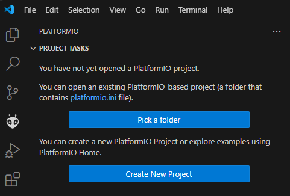

TapCAN_Demo
=

TapCAN_Demo is a starter app to demonstrate the various capabilities of the TapCAN device and provide a starting point for your app.

The main application is built using **Arduino**(https://www.arduino.cc/). The GUI was generated using **LVGL**(https://lvgl.io/) and **SquareLine Studio**(https://squareline.io/)

LVGL is open source and free to use. Even though we highly recommend using SquareLine Studio, hand code using LVGL directly works fine too

Quick Start
=
For the easiest startup we recommend using VS Code with PlatformIO
1. Install VS Code (https://code.visualstudio.com/)
2. Add the PlatformIO extension 
3. Clone or download the TapCAN_Demo project (https://github.com/Avela-Technologies/TapCAN_Demo.git) to a location of your choice
4. Click on the PlatformIO extension icon in the vertical shortcut bar and then click on Pick a folder
   

5. Select the folder where you placed the TapCAN_Demo project. PlatformIO will begin initializing and performing any required configuration steps. This may take a little time.
6. Once configuration is complete, the bottom horizontal task bar should now include a few new icons:    
7. Plug the TapCAN device into a USB port and click on the  icon. The TapCAN software will build and download into the device. 
8. You're now ready to start making your own changes and experimenting
   
